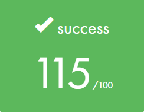

# So_long
This is the first graphic project at [42](https://www.42sp.org.br).

### What is so_long?
So_long is an individual project in [42](https://www.42sp.org.br) that requires us to create a very small 2D game.
Its purpose is to make you work with textures, sprites, and some other very basic gameplay elements using [MinilibX](https://harm-smits.github.io/42docs/libs/minilibx/introduction.html).

#### Gameplay


#### Badge


#### Objectives
- Applicative

#### Skills
- Graphics
- Imperative programming

#### My grade


## Getting started
**Follow the steps below**
```bash
# Clone the project and access the folder
git clone https://github.com/gialexan/so_long-42 && cd so_long-42/
# Run make for create the game without enemies and animations
make
# Run make bonus for create the game with enemies and animations
make bonus
# Clean output objects with
make fclean
# Well done!
```
